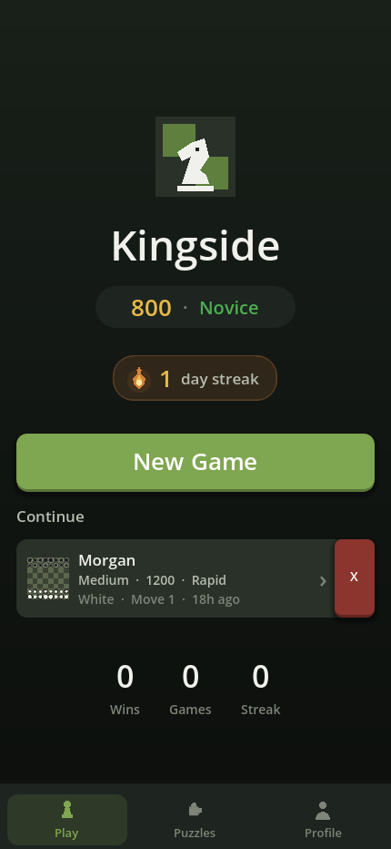
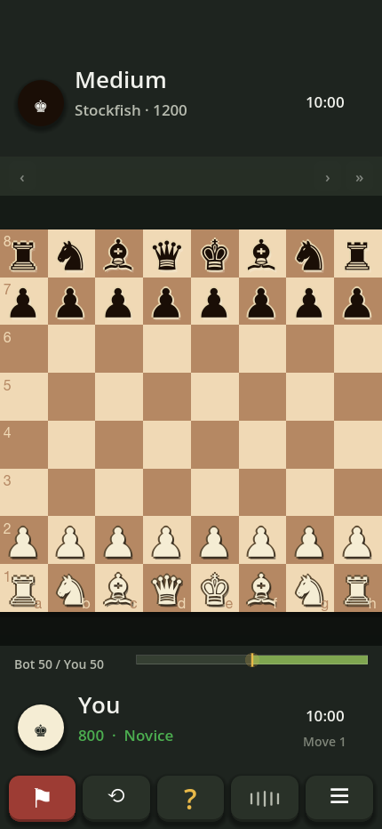
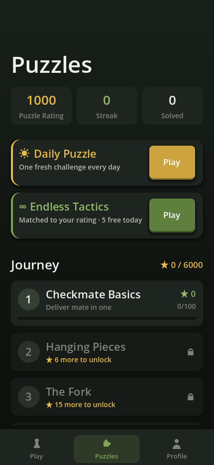
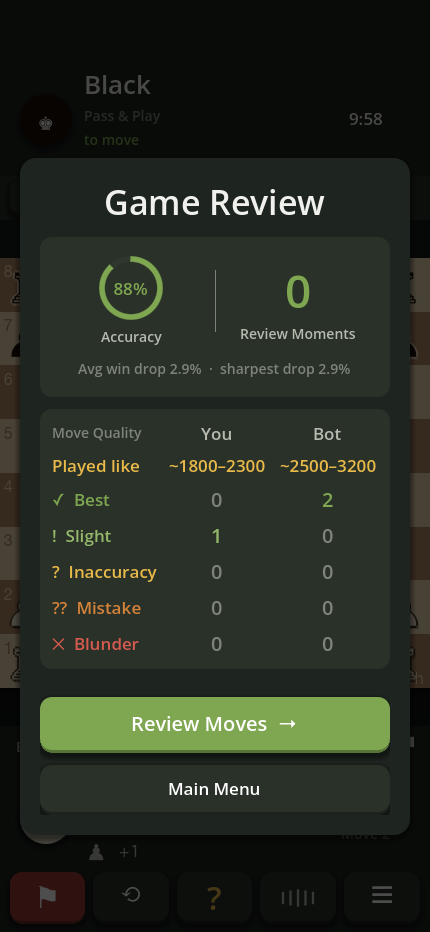

<h1 align="center">♟ Kingside — Offline Chess</h1>

<p align="center">
  A complete, <b>fully-offline</b> chess app for iOS. Play real Stockfish bots,
  solve thousands of puzzles, review every game, and move by voice —
  <b>no account, no ads, no internet required</b>.
</p>

<p align="center">
  
  
  
  
</p>

<p align="center">
  
  
  
  
</p>

---

## Features

- ♟ **Real Stockfish bots** — 7 tiers from total beginner to full strength, plus a custom-Elo slider. The engine runs **on-device** and is weakened realistically, so low tiers make human-like blunders instead of perfect moves.
- 📈 **Rating & progression** — a chess.com-style ELO that rises and falls with your results, title bands, and a daily-streak flame.
- 🧩 **2,000+ puzzles** — a 20-level star-gated **Journey**, plus endless rating-matched tactics and a daily puzzle.
- 🔍 **Unlimited game review** — move-by-move accuracy, an eval graph, blunder/brilliant tags, and the engine's best line at every turn. Free, offline, no paywall.
- 🎙 **Voice moves** — hands-free *"knight f3"* via on-device speech recognition.
- 👥 **Pass & Play** — two players sharing one device.
- 🔒 **No account, no ads, no network** — everything runs locally on your phone.

## How it's built

- **[Godot 4.7](https://godotengine.org)** (Mobile renderer); the UI is built imperatively in **GDScript** against a single design system (`scripts/ui/UITheme.gd`).
- **[Stockfish](https://stockfishchess.org)** compiled as a native **GDExtension** (`gdextension/`), with a portable GDScript alpha-beta engine as a fallback.
- **On-device speech** (`SFSpeechRecognizer`) powers voice moves; native GDExtensions cover the Apple-specific bits.
- Global state lives in **autoload singletons** (`ChessLogic`, `AIEngine`, `PlayerData`, `PuzzleManager`, …); each screen builds its own UI in code.

> Deeper notes — the honest bot-strength calibration, the review/accuracy method, and the native build — live in **[docs/ARCHITECTURE.md](docs/ARCHITECTURE.md)**.

## Running it

Open the project in **Godot 4.7** and press play, or export from **Project → Export**. Prebuilt iOS/macOS native binaries are committed under `gdextension/bin/`.

Deploy to a tethered iPhone (export → sign → install → launch):

```bash
tools/ios_deploy.sh
```

## Tests

```bash
GODOT=/Applications/Godot.app/Contents/MacOS/Godot

$GODOT --headless -s res://test_chesslogic.gd                       # rules + perft
$GODOT --headless    res://test_puzzles.tscn                        # replay every bundled puzzle
$GODOT --headless -s res://scripts/tools/test_voice_move_parser.gd  # voice parsing
```

## Project layout

```
scripts/
  autoload/   ChessLogic, AIEngine (+ backends), GameManager, PlayerData, PuzzleManager, …
  ui/         screens + UITheme + board rendering
  ui/game/    GameScreen components (Hud / Voice / Review / Modals / Widgets)
assets/
  puzzles/    baked Journey + tactics pool
gdextension/  native Stockfish + speech sources and prebuilt binaries
tools/        build, deploy, puzzle-baking, and screenshot scripts
docs/         architecture, distribution, and setup notes
```

## License

Kingside is free, open-source software under the **GNU General Public License v3** (see [`LICENSE`](LICENSE)).

It bundles the **Stockfish** chess engine (© the Stockfish developers), which is also GPLv3 and is compiled into the app as a native engine. Because a GPLv3 engine is linked in, the combined work — all of Kingside — is distributed under **GPLv3**. Built with the [Godot Engine](https://godotengine.org) (MIT).

Source: <https://github.com/kevincardona/kingside>
